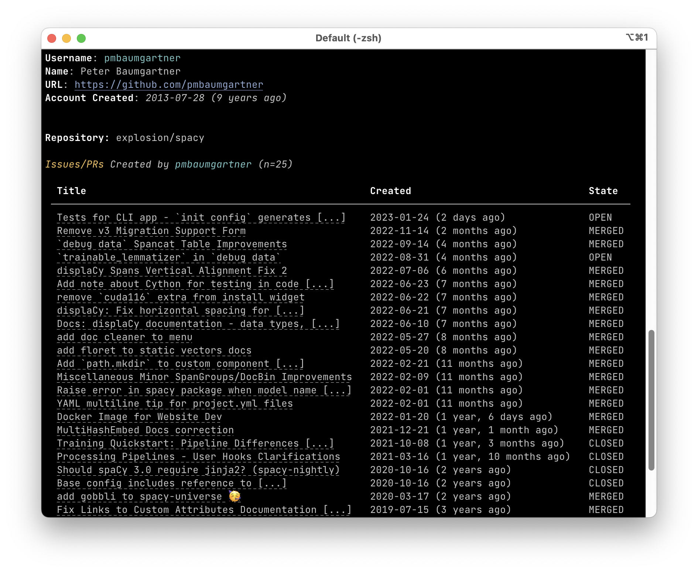

# Repo Author Inspect

A simple CLI tool to view issues, PRs, and discussions by an author on a repo.

## Requirements

You'll need a Personal Access Token (PAT) with `read:discussion` permission. See the docs on this [here](https://docs.github.com/en/authentication/keeping-your-account-and-data-secure/creating-a-personal-access-token#creating-a-personal-access-token-classic).

You'll then need to set this token to the `GITHUB_TOKEN` environment variable. You can do this by putting `GITHUB_TOKEN=<YOUR_TOKEN>` before running each command, or doing `export GITHUB_TOKEN=<YOUR_TOKEN>` to store it as an environment variable. 

**Install**

```
pip install git+https://github.com/pmbaumgartner/gh-author-inspect
```

## Usage

Run the command `gh-author-inspect <repo> <username>`, e.g.:

```bash
gh-author-inspect explosion/spacy pmbaumgartner
```

```
Username: pmbaumgartner
Name: Peter Baumgartner
URL: https://github.com/pmbaumgartner
Account Created: 2013-07-28 (9 years ago)


Repository: explosion/spacy

Issues/PRs Created by pmbaumgartner (n=25)                                                          
                                                                                                    
  Title                                                Created                              State   
 ────────────────────────────────────────────────────────────────────────────────────────────────── 
  Tests for CLI app - `init config` generates [...]    2023-01-24 (2 days ago)              OPEN    
  Remove v3 Migration Support Form                     2022-11-14 (2 months ago)            MERGED  
  `debug data` Spancat Table Improvements              2022-09-14 (4 months ago)            MERGED  
  `trainable_lemmatizer` in `debug data`               2022-08-31 (4 months ago)            OPEN    
  displaCy Spans Vertical Alignment Fix 2              2022-07-06 (6 months ago)            MERGED  
  Add note about Cython for testing in code [...]      2022-06-23 (7 months ago)            MERGED  
  remove `cuda116` extra from install widget           2022-06-22 (7 months ago)            MERGED  
  displaCy: Fix horizontal spacing for [...]           2022-06-21 (7 months ago)            MERGED  
  Docs: displaCy documentation - data types, [...]     2022-06-10 (7 months ago)            MERGED  
  add doc cleaner to menu                              2022-05-27 (8 months ago)            MERGED  
  add floret to static vectors docs                    2022-05-20 (8 months ago)            MERGED  
  Add `path.mkdir` to custom component [...]           2022-02-21 (11 months ago)           MERGED  
  Miscellaneous Minor SpanGroups/DocBin Improvements   2022-02-09 (11 months ago)           MERGED  
  Raise error in spacy package when model name [...]   2022-02-01 (11 months ago)           MERGED  
  YAML multiline tip for project.yml files             2022-02-01 (11 months ago)           MERGED  
  Docker Image for Website Dev                         2022-01-20 (1 year, 6 days ago)      MERGED  
  MultiHashEmbed Docs correction                       2021-12-21 (1 year, 1 month ago)     MERGED  
  Training Quickstart: Pipeline Differences [...]      2021-10-08 (1 year, 3 months ago)    CLOSED  
  Processing Pipelines - User Hooks Clarifications     2021-03-16 (1 year, 10 months ago)   CLOSED  
  Should spaCy 3.0 require jinja2? (spacy-nightly)     2020-10-16 (2 years ago)             CLOSED  
  Base config includes reference to [...]              2020-10-16 (2 years ago)             CLOSED  
  add gobbli to spacy-universe 🥳                      2020-03-17 (2 years ago)             MERGED  
  Fix Links to Custom Attributes Documentation [...]   2019-07-15 (3 years ago)             MERGED  
  Span **attributes not updating                       2018-05-29 (4 years ago)             CLOSED  
  Installing Models from pip with requirements.txt     2017-11-25 (5 years ago)             CLOSED  
                                                                                                    
Discussions Created by pmbaumgartner (n=2)                                                         
                                                                                                   
  Title                                           Created                              State       
 ───────────────────────────────────────────────────────────────────────────────────────────────── 
  spacy-project-viz: visualize your spaCy [...]   2021-03-16 (1 year, 10 months ago)   UNANSWERED  
  Blank Project Template / NLP Project [...]      2021-03-10 (1 year, 10 months ago)   UNANSWERED  
```

In a real terminal, there is some additional formatting applied. The title of each piece of content is also a hyperlink to that content.



